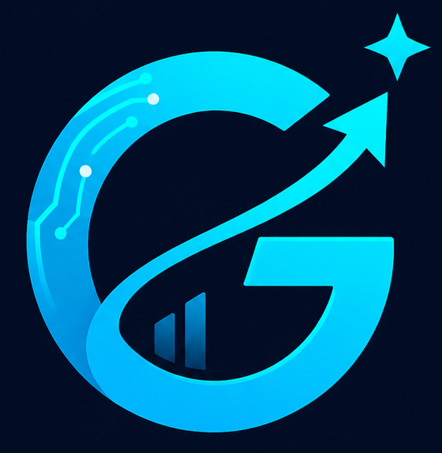

<div align="center">



# 🚀 GoalNow-AI

### Plan Smarter. Track Daily. Improve Weekly.

GoalNow-AI is an AI-powered goal tracking platform where users can create normal habit trackers and complex long-term AI-based goal trackers with daily plans, progress reports, weekly tests, and an AI mentor.

<br />


<br />


<br />

<a href="https://goalnow-ai.vercel.app">
  
</a>

</div>

---

## ✨ About GoalNow-AI

**GoalNow-AI** is a modern goal management app designed to help users move from planning to real execution.

It supports two types of tracking systems:

- **Normal Tracker** — for simple habit-style goals.
- **Complex AI Tracker** — for serious long-term goals like coding preparation, exam preparation, fitness, business growth, English improvement, and more.

The platform helps users create a plan, track daily work, analyze progress, take weekly tests, and get guidance from an AI mentor.

---

## 🎯 Main Vision

Most people create goals but fail because they do not have:

- A clear daily plan
- A simple tracking system
- Progress feedback
- Weekly review
- Practical guidance after missing days
- Motivation based on real progress

GoalNow-AI is being built to solve this problem with a clean dashboard, AI-assisted planning, smart progress reports, and a mentor-like experience.

---

## 🔥 Key Features

### ✅ 1. Normal Goal Tracker

Create and manage simple goals such as:

- Drink water daily
- Save money weekly
- Exercise regularly
- Study every day
- Build a small habit

Normal trackers are useful for simple daily, weekly, or monthly tracking.

---

### 🤖 2. Complex AI Goal Tracker

Create serious long-term goals such as:

- Google SWE preparation
- Full-stack web development
- English communication improvement
- Competitive exam preparation
- Fitness transformation
- Business growth plan
- Skill mastery roadmap

Complex trackers can include:

- Daily tasks
- Long-term plan
- Active day tracking
- Weekly test
- AI mentor
- Progress report
- PDF export support

---

### 📊 3. Goal Dashboard

The dashboard works as the user’s personal goal command center.

It includes:

- Goal overview
- Active goals
- Completed goals
- Normal tracker section
- Complex tracker section
- Progress status
- Goal actions
- Account-based goal loading

---

### 🔐 4. Supabase Authentication

GoalNow-AI uses **Supabase Auth** for user authentication.

Current auth features:

- User signup
- User login
- Session handling
- Protected dashboard behavior
- Account-based data access

Main Supabase files:

```txt
src/lib/supabase/client.ts
src/lib/supabase/server.ts
src/lib/supabase/proxy.ts
proxy.ts
```

---

### 🗄️ 5. Supabase Goal Storage

Goal data is connected with Supabase.

Current backend goal features:

- Create goal
- Read all user goals
- Read single goal
- Update goal
- Delete goal
- Store goals with user ID

Main goal backend file:

```txt
src/lib/goals/supabaseGoals.ts
```

Supporting converter file:

```txt
src/lib/goals/converters.ts
```

---

### 🧠 6. AI Mentor

Each complex goal can include an AI mentor page.

The mentor is designed to:

- Give short practical replies
- Help users continue after missed days
- Suggest the next best action
- Stay focused on the user’s goal
- Avoid confusing or overly long advice

Example mentor behavior:

```txt
Missed yesterday?
No problem. Continue from your current active day.
Do not restart. Complete today’s task and stay consistent.
```

---

### 📝 7. Weekly Test System

Complex goals can include weekly tests.

The weekly test feature is planned to help users:

- Check progress
- Revise important topics
- Practice regularly
- Build accountability
- Understand weak areas

---

### 📈 8. Progress Report

GoalNow-AI includes progress report pages to show how the user is performing.

Progress report goals:

- Show completion percentage
- Show consistency
- Show skipped days
- Show over-completion
- Show current progress
- Help users improve weekly

---

### 📄 9. Professional PDF Export

GoalNow-AI is being improved to support professional PDF exports.

Planned PDF export style:

- Goal details only on the first page
- Daily plan pages after that
- Tick boxes for each task
- GoalNow-AI branding
- One diagonal watermark per page
- Clean professional layout

---

### 🌐 10. Multi-language Support

GoalNow-AI is planned to support:

- English
- Bengali
- Hindi

The target is full-app translation, not only navbar translation.

---

## 🧩 Feature Overview

| Feature | Status |
|---|---|
| Landing Page | ✅ Added |
| Dashboard | ✅ Added |
| Normal Tracker | ✅ Added |
| Complex Tracker | ✅ Added |
| Supabase Auth | ✅ Added |
| Supabase Goal Storage | ✅ Added |
| Goal Create/Edit/Delete | ✅ Added |
| AI Mentor Page | ✅ Added |
| Weekly Test Page | ✅ Added |
| Progress Report Page | ✅ Added |
| PDF Export | 🚧 In Progress |
| Legacy LocalStorage Import | 🚧 Planned |
| Full Language Switch | 🚧 Planned |
| Advanced Analytics | 🚧 Planned |
| Separate DB Tables | 🚧 Planned |

---

## 🏗️ Tech Stack

| Technology | Purpose |
|---|---|
| **Next.js** | App framework |
| **React** | UI building |
| **TypeScript** | Type safety |
| **Tailwind CSS** | Styling |
| **Supabase Auth** | Login/signup |
| **Supabase Database** | Goal storage |
| **Vercel** | Deployment |

---

## 📁 Project Structure

```txt
GoalNow-AI/
│
├── public/
│   └── logo.png
│
├── src/
│   ├── app/
│   │   ├── dashboard/
│   │   │   └── page.tsx
│   │   │
│   │   ├── goals/
│   │   │   ├── new/
│   │   │   │   └── page.tsx
│   │   │   │
│   │   │   └── [id]/
│   │   │       ├── page.tsx
│   │   │       ├── edit/
│   │   │       ├── mentor/
│   │   │       ├── report/
│   │   │       └── test/
│   │   │
│   │   ├── login/
│   │   ├── signup/
│   │   └── page.tsx
│   │
│   ├── components/
│   │   ├── Navbar.tsx
│   │   ├── Footer.tsx
│   │   └── DashboardWelcome.tsx
│   │
│   ├── lib/
│   │   ├── goals/
│   │   │   ├── supabaseGoals.ts
│   │   │   └── converters.ts
│   │   │
│   │   └── supabase/
│   │       ├── client.ts
│   │       ├── server.ts
│   │       └── proxy.ts
│   │
│   └── types/
│       └── goal.ts
│
├── proxy.ts
├── package.json
├── tailwind.config.ts
├── tsconfig.json
└── README.md
```

---

## 🧠 How GoalNow-AI Works

```txt
User creates goal
        ↓
Goal type selected
        ↓
Normal Tracker or Complex Tracker
        ↓
Goal saved to Supabase
        ↓
Dashboard loads account goals
        ↓
User tracks progress daily
        ↓
Weekly test and report help user improve
        ↓
AI mentor gives practical guidance
```

---

## 🔐 Environment Variables

Create a `.env.local` file in the project root.

```env
NEXT_PUBLIC_SUPABASE_URL=your_supabase_project_url
NEXT_PUBLIC_SUPABASE_ANON_KEY=your_supabase_anon_key
```

Do not commit `.env.local` to GitHub.

---

## 🚀 Getting Started

### 1. Clone the repository

```bash
git clone https://github.com/shubhamdey665-coder/GoalNow-AI.git
```

### 2. Go into the project folder

```bash
cd GoalNow-AI
```

### 3. Install dependencies

```bash
npm install
```

### 4. Add environment variables

Create:

```txt
.env.local
```

Add:

```env
NEXT_PUBLIC_SUPABASE_URL=your_supabase_project_url
NEXT_PUBLIC_SUPABASE_ANON_KEY=your_supabase_anon_key
```

### 5. Run the development server

```bash
npm run dev
```

### 6. Open in browser

```txt
http://localhost:3000
```

---

## 🧪 Available Scripts

```bash
npm run dev
```

Starts the local development server.

```bash
npm run build
```

Creates a production build.

```bash
npm run start
```

Starts the production server.

```bash
npm run lint
```

Runs lint checking if configured.

---

## 🧱 Current Development Status

GoalNow-AI currently has:

- Modern landing page
- Dashboard
- Goal creation system
- Goal editing
- Goal detail page
- Normal tracker support
- Complex tracker support
- Supabase Auth
- Supabase goal storage
- Dashboard login handling
- AI mentor page
- Weekly test page
- Progress report page

---

## 🛠️ Upcoming Improvements

Next planned improvements:

- Add old localStorage goal import system
- Add Supabase SQL migration files
- Improve dashboard mobile responsiveness
- Improve PDF export with logo and watermark
- Add separate database tables for goal days and tasks
- Add mentor message history table
- Add weekly test result history table
- Add full app language switching
- Add advanced progress analytics
- Add notification system
- Add better production-level empty states

---

## 🗺️ Future Database Plan

Current MVP can store complex goal data in Supabase.

Future professional database structure:

```txt
users
goals
goal_days
goal_tasks
normal_checkins
mentor_messages
test_results
progress_snapshots
```

This will make the app more scalable and easier to maintain.

---

## 🎨 UI Goals

GoalNow-AI aims for a professional SaaS-style interface:

- Dark premium theme
- Clean cards
- Smooth animations
- Mobile-friendly layout
- Clear dashboard sections
- Strong branding
- Useful empty states
- Real-app feeling

---

## 📸 Screenshots

Add screenshots later inside:

```txt
public/screenshots/
```

Recommended screenshot files:

```txt
public/screenshots/landing.png
public/screenshots/dashboard.png
public/screenshots/goal-detail.png
public/screenshots/report.png
```

Then add them here like this:

```md

```

---

## 🤝 Contribution

This project is currently built for learning, personal development, and product-building practice.

Suggestions, improvements, and feature ideas are welcome.

---

## 👨‍💻 Author

<div align="center">

### Built by Shubham Dey


</div>

---

## ⭐ Support

If you like this project, give it a star on GitHub.

It helps the project grow and motivates future improvements.

---

<div align="center">

## GoalNow-AI

### Plan. Track. Improve.


</div>